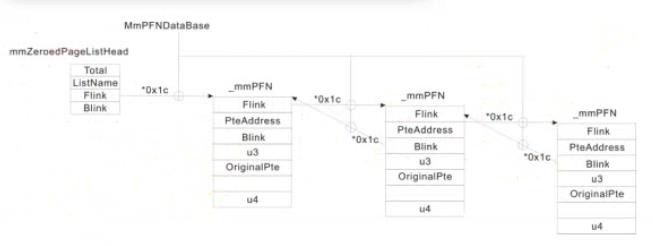
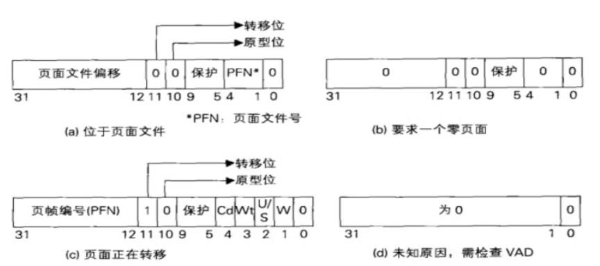

<!-- TOC -->

- [1. 线性地址的管理](#1-线性地址的管理)
  - [1.1. 进程空间的地址划分](#11-进程空间的地址划分)
  - [1.2. 内核的线性地址管理](#12-内核的线性地址管理)
  - [1.3. 用户空间的线性地址管理](#13-用户空间的线性地址管理)
    - [1.3.1. 私有内存：PrivateMemory](#131-私有内存privatememory)
      - [1.3.1.1. 堆与栈：使用私有内存](#1311-堆与栈使用私有内存)
    - [1.3.2. 映射内存：Map](#132-映射内存map)
      - [1.3.2.1. 创建映射内存：CreateFileMapping函数](#1321-创建映射内存createfilemapping函数)
      - [1.3.2.2. 全局变量：使用映射内存](#1322-全局变量使用映射内存)
      - [1.3.2.3. 文件映射和写拷贝](#1323-文件映射和写拷贝)
- [2. 物理地址的管理](#2-物理地址的管理)
  - [2.1. 32位操作系统的最大物理内存](#21-32位操作系统的最大物理内存)
  - [2.2. 实际物理内存大小](#22-实际物理内存大小)
  - [2.3. 页帧数据库](#23-页帧数据库)
  - [2.4. 物理页的状态及状态链表](#24-物理页的状态及状态链表)
    - [2.4.1. 未使用的物理页](#241-未使用的物理页)
    - [2.4.2. 已使用的物理页](#242-已使用的物理页)
  - [2.5. 页帧数据库、物理页与状态链表的关系](#25-页帧数据库物理页与状态链表的关系)
- [3. 缺页异常](#3-缺页异常)
  - [3.1. 触发缺页异常](#31-触发缺页异常)
  - [3.2. 挂上物理页的时机](#32-挂上物理页的时机)
  - [3.3. 写拷贝类型的缺页异常](#33-写拷贝类型的缺页异常)
- [4. 其它](#4-其它)

<!-- /TOC -->
# 1. 线性地址的管理
## 1.1. 进程空间的地址划分
|分区|x86 32位Windows|
|:-:|:-:|
|空指针赋值区|0x00000000-0x0000FFFF|
|用户模式区|0x00001000-0x7FFEFFFF|
|64KB禁入区（空区域）|0x7FFEFFFF-0x7FFFFFFF|
|内核|0x80000000-0xFFFFFFFF|
## 1.2. 内核的线性地址管理
Windows使用链表来记录内核的线性地址分配情况，每个节点标识了未分配的地址空间。详见《Windows内核原理与实现》。
## 1.3. 用户空间的线性地址管理
由于每个进程的用户空间不同，链表效率低下，所以Windows使用搜索二叉树来记录用户空间线性地址分配情况，每个节点标识一块已经被占用的线性地址。EPROCESS.VadRoot指向根节点，节点为_MMVAD结构体，结构体包含内存块的起始结束线性地址、类别和属性等信息。通过Windbg指令`!vad`可以查看一个进程的线性地址分配的所有情况。内存块分为两种，私有内存和映射内存。
### 1.3.1. 私有内存：PrivateMemory
通过VirtualAlloc函数分配的内存空间为私有内存（进程私有）。
```c
LPVOID VirtualAlloc{
    LPVOID lpAddress,         // 要分配的内存区域的地址，NULL则由操作系统分配
    DWORD dwSize,             // 分配的大小，分配的最小单元为一个物理页4KB
    DWORD flAllocationType,   // 分配的类型，Reserved代表预留线性地址空间，但是不分配物理页，commit代表分配线性地址空间并分配物理页
    DWORD flProtect           // 该内存的初始保护属性
};
```
VirtualAllocEx函数可以在其它进程的空间内申请内存。
#### 1.3.1.1. 堆与栈：使用私有内存
操作系统在创建进程的时候，会申请私有内存用作进程的堆和栈。当进程使用malloc申请堆内存的时候，只需在内存块中分配即可，无需进入零环。压栈弹栈等栈操作则可以直接使用。
### 1.3.2. 映射内存：Map
映射内存可以多进程共享，一般来说进程的Map内存块占比更大。映射内存有以下两类：
* 共享内存：多个进程共享物理页，一个进程创建映射内存之后，其它进程可以通过OpenFileMapping和MapViewOfFile来共享该内存
* 文件映射：多个进程共享文件（可执行文件或者数据文件），如Kernel32.dll
#### 1.3.2.1. 创建映射内存：CreateFileMapping函数
```c
HANDLE WINAPI CreateFileMapping(
_In_HANDLE hFile,                             //指示映射的文件句柄，如果该值为INVALID_HANDLE_VALUE（对应值-1），则只分配物理页，不关联文件
_In_opt_LPSECURITY_ATTRIBUTES lpAttributes,
_In_DWORD flProtect,
_In_DWORD dwMaximumSizeHigh,
_In_DWORD dwMaximumSizeLow,
_In_opt_LPCTSTR lpName                        //名称，用于其它进程跨进程打开、共享该内存块
);
```
CreateFileMapping函数会创建物理页并与文件关联（如果指定了文件的话），之后需要使用MapViewOfFile分配进程线性地址，并将线性地址与物理页进行挂钩。
#### 1.3.2.2. 全局变量：使用映射内存
全局变量存在可执行文件的.data节里，位于映射内存中。
#### 1.3.2.3. 文件映射和写拷贝
文件映射将文件映射后，所有对内存的改动，都会反馈到文件和其它进程的映射内存。为了防止出现映射库文件导致文件被修改的情况，在映射文件的时候，可以设置权限为写拷贝（WRITECOPY），一旦对映射的内存进行写操作时，会将自身拷贝到另一个新的物理页，以供进程进行操作。LoadLirbrary函数其实就是应用了写拷贝机制的文件映射操作。
# 2. 物理地址的管理
## 2.1. 32位操作系统的最大物理内存
* 10-10-12分页：4GB
* 2-9-9-12分页（PAE分页）：64GB
* 有的版本的XP系统通过内核模块的ExVerifySuite等函数限制了最大物理内存为4GB（即使使用PAE分页）
## 2.2. 实际物理内存大小
存在一个全局变量MmNumberOfPhysicalPages，标识了实际物理页的数量，数量乘以4KB就是实际物理内存的大小。
## 2.3. 页帧数据库
全局指针`_MMPFN* MmPfnDatabase`指向了页帧数据库，该数据库为_MMPFN结构体类型的数组。每个物理页（无论处于什么状态）对应一个_MMPFN结构体，所以该数组的长度为MmNumberOfPhysicalPages。每个物理页在物理地址空间的索引就是其对应结构体在数组中的索引，所以每个_MMPFN结构体对应物理页的物理地址可由其索引乘以4KB获取。
## 2.4. 物理页的状态及状态链表
### 2.4.1. 未使用的物理页
对于未使用的物理页，MMPFN.u3.e1.PageLocation（MMPFN.u3.e1为MMPFNENTRY结构体类型，是一个位段类型）指示了物理页的状态，Windows使用链表将相同状态的物理页连接起来。
* 0：零化状态，已经被零化（清零-由操作系统而非用户程序完成），可以直接被使用的物理页。对应MmZeroedPageListHead链表
* 1：空闲状态，刚被释放但是没有被零化的物理页。操作系统在空闲的时候有专门的线程从这个队列摘取物理页，清零后再挂入零化链表。对应MmFreePageListHead链表
* 2：备用状态，因内存交换（内存写入磁盘）被释放的物理页。如果该物理页还未被零化，就被原线程重新申请，该页将会被直接使用。对应MmStandbyPageListHead链表
* 3：对应MmModifiedPageListHead链表
* 4：对应MmModifiedNoWritePageListHead链表
* 5：坏页状态，物理页对应硬件损坏，无法使用。对应MmBadPageListHead链表
### 2.4.2. 已使用的物理页
EPROCESS.Vm.VmWorkingSetList指示了当前进程已使用的所有物理页（称为进程工作集，另外还存在系统工作集），EPROCESS.Vm.MinimumWorkingSetSize和EPROCESS.Vm.MaximumWorkingSetSize则指示了当前进程能使用的最小和最大的物理内存大小。
## 2.5. 页帧数据库、物理页与状态链表的关系
这里的Flink和Blink的值都是物理页的索引值，需要经过计算才能转换为地址指针。

# 3. 缺页异常
为了更有效地使用物理页，得益于虚拟内存即内存交换机制（虚拟内存文件为C盘根目录下的隐藏文件pagefile.sys，文件大小和虚拟内存大小相同），物理页是周转使用的，所以缺页异常会经常性的发生。
## 3.1. 触发缺页异常
当CPU访问一个线性地址，其PTE的P位为0，代表此地址并未挂上物理页，此时会产生缺页异常。下图为无效PTE的四种情况：

## 3.2. 挂上物理页的时机
当使用VirtualAlloc函数分配内存空间时，即使通过commit方式，也并不会立即给地址挂上物理页。只有当程序真正使用地址即对地址进行读写或执行的时候，才会给地址真正挂上物理页。
## 3.3. 写拷贝类型的缺页异常
写拷贝机制也是通过缺页异常完成的，步骤如下：
* 设置PTE为只读，物理页权限为写拷贝
* 进程写页面，触发异常
* 进入异常处理函数
* 发现物理页权限为写拷贝
* 创建新物理页，并将内容复制过去，更换线性地址关联的物理页

所以如果需要绕过写拷贝机制进行全局HOOK，只需要编写驱动来修改需HOOK部分对应的物理页的PTE为可读可写即可
# 4. 其它
关于内存管理，更详细的信息见潘爱民《Windows内核原理与实现》。