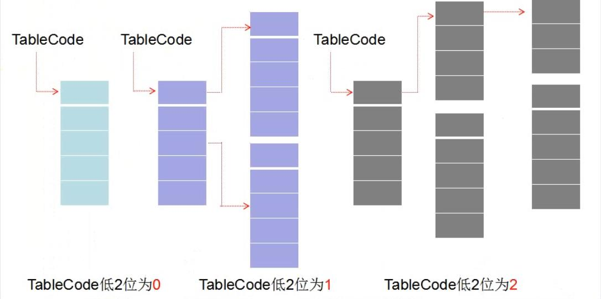

<!-- TOC -->

- [1. 进程句柄表](#1-进程句柄表)
  - [1.1. 如何找到进程句柄表](#11-如何找到进程句柄表)
- [2. 句柄表的作用](#2-句柄表的作用)
- [3. 句柄表的结构](#3-句柄表的结构)
- [4. 全局句柄表](#4-全局句柄表)

<!-- /TOC -->

# 1. 进程句柄表

当一个进程创建或者打开一个内核对象时，将会获得一个句柄，句柄的值除以4就是该内核对象在进程句柄表中的索引。进程句柄表位于0环，其中存储了进程引用的各个内核对象的指针。所有的内核对象均以_OBJECT_HEADER结构体（0x18大小）开头，而进程句柄表中存储的指针指向_OBJECT_HEADER结构体。

## 1.1. 如何找到进程句柄表

进程句柄表位于_EPROCESS.ObjectTable，其中_EPROCESS.ObjectTable.TableCode即为句柄表的内存地址。同一个内核对象可以被不同的进程引用，其句柄值可能一样也可能不一样。

# 2. 句柄表的作用

隐藏内核对象指针，保护内核对象。

# 3. 句柄表的结构

句柄表中，每个内核对象占据8个字节，所以一个物理页可以容纳512个表项。如果TableCode低2位为0，则句柄表为1级结构；如果TableCode低2位为1，则句柄表为2级结构；如果TableCode低2位为2，则句柄表为3级结构。

# 4. 全局句柄表

系统另外维护有一个全局句柄表PsdCidTable，存储了所有的进程和线程（无论是否被打开）的指针（全局句柄表中的指针直接指向内核对象的主体，并不指向_OBJECT_HEADER结构体）。每个进程和线程的编号（PID、CID）除以4其实就是进程和线程在全局句柄表中的索引。PsLookupProcessThreadByCid、PsLookupProcessByProcessId、PsLookupThreadByThreadId这三个函数均为通过编号查找信息的函数，他们其实就是通过全局句柄表来找到内核对象指针并查询信息的。
