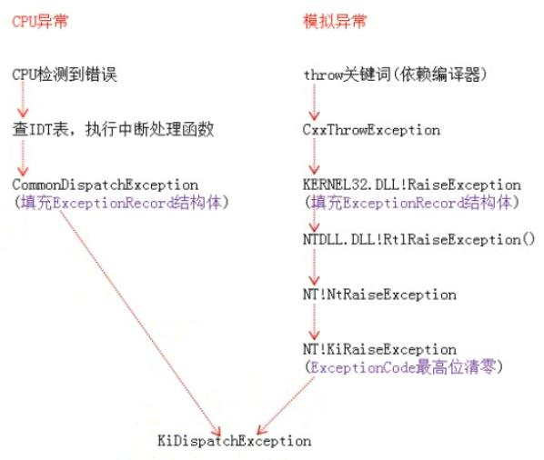
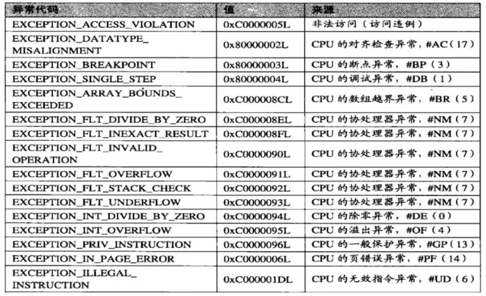
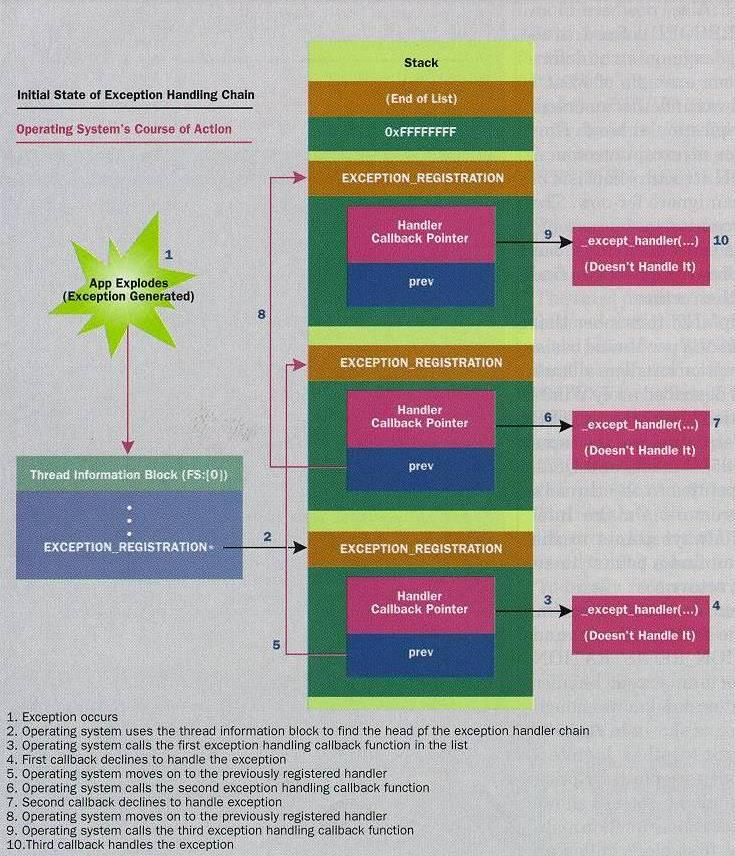
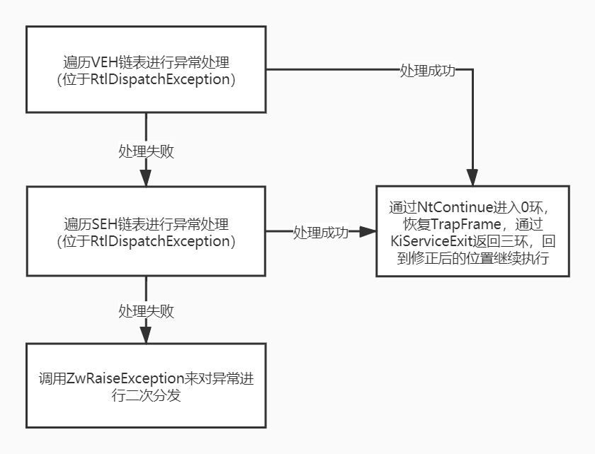
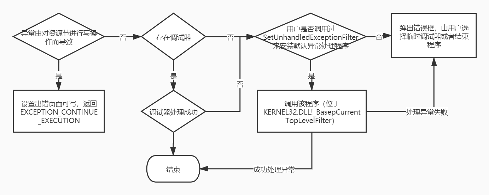

<!-- TOC -->

- [1. 概述](#1-概述)
  - [1.1. 异常与调试的关联](#11-异常与调试的关联)
  - [1.2. 参考资料](#12-参考资料)
  - [1.3. 异常处理机制](#13-异常处理机制)
  - [1.4. 异常的类别](#14-异常的类别)
  - [1.5. 异常的处理流程](#15-异常的处理流程)
- [2. 记录异常信息](#2-记录异常信息)
  - [2.1. 异常类型代码](#21-异常类型代码)
  - [2.2. 模拟异常的特殊填充](#22-模拟异常的特殊填充)
- [3. 异常分发：KiDispatchException](#3-异常分发kidispatchexception)
  - [3.1. 异常回调函数在哪里](#31-异常回调函数在哪里)
  - [3.2. KiDispatchException](#32-kidispatchexception)
  - [3.3. 用户态分发：KiUserExceptionDispatcher](#33-用户态分发kiuserexceptiondispatcher)
    - [3.3.1. VEH](#331-veh)
  - [3.4. 展开（UNWIND）](#34-展开unwind)
    - [3.4.1. 局部展开](#341-局部展开)
    - [3.4.2. 全局展开](#342-全局展开)
- [4. 异常处理](#4-异常处理)
  - [4.1. 函数格式](#41-函数格式)
  - [4.2. 函数返回值](#42-函数返回值)
- [5. 编译器层面的异常处理机制](#5-编译器层面的异常处理机制)
  - [5.1. 代码形式](#51-代码形式)
  - [5.2. 过滤器表达式](#52-过滤器表达式)
  - [5.3. VC++的拓展：VC\_EXCEPTION\_REGISTRATION](#53-vc的拓展vc_exception_registration)
    - [5.3.1. \_\_except\_handler3](#531-__except_handler3)
  - [5.4. 未处理异常](#54-未处理异常)
    - [5.4.1. 第一道防线：VC++](#541-第一道防线vc)
    - [5.4.2. 第二道防线：kernel32.dll](#542-第二道防线kernel32dll)
    - [5.4.3. 过滤器表达式：UnhandledExceptionFilter函数](#543-过滤器表达式unhandledexceptionfilter函数)

<!-- /TOC -->
# 1. 概述
## 1.1. 异常与调试的关联
异常与调试是紧密相连的，异常是调试的基础。软件调试、反调试、调试器都与异常息息相关。
## 1.2. 参考资料
微软工程师Matt Pietrek所发表的《A Crash Course on the Depths of Win32™ Structured Exception Handling》。
## 1.3. 异常处理机制
当一个线程出现错误时，操作系统调用用户定义的一个回调函数，用以修复错误或者进行其它任何事情，并返回一个值来告诉操作系统下一步做什么。
## 1.4. 异常的类别
* 按照产生源分类
    * CPU异常：由CPU产生、发现的异常
    * 模拟异常：由软件模拟产生，如throw、raise语句
* 按照产生位置分类
    * 内核异常：在内核产生的异常
    * 用户异常：在用户空间产生的异常
## 1.5. 异常的处理流程
* 记录异常信息（异常类型、异常发生的位置等）
* 进行异常分发：寻找异常的处理函数
* 异常处理：调用异常处理函数
# 2. 记录异常信息


throw关键词和CxxThrowException为C语言的模拟异常特征，其它编程语言提供的模拟异常机制的这两点（关键词和初始调用函数）是不同的。
## 2.1. 异常类型代码

## 2.2. 模拟异常的特殊填充
模拟异常在填充ExceptionRecord结构体的时候，ExceptionCode为一个固定值，该值依赖于编译环境；ExceptionAddress也是固定值，为RaiseException函数的地址。
# 3. 异常分发：KiDispatchException
## 3.1. 异常回调函数在哪里
SEH是线程相关的，也就是说每个线程有它自己的异常处理回调函数。通过当前线程的FS:[0]可以找到TEB，进而找到一个_EXCEPTION_REGISTRATION_RECORD结构体链表（该结构一般位于栈中，零环和三环均使用该结构体，一个结构体对应一个异常处理函数），操作系统遍历该链表，以查找一个同意处理该异常的结构体（通过返回值表达是否同意处理），只要找到一个处理异常的函数，就会停止遍历。

## 3.2. KiDispatchException
所有类型的异常均通过KiDispatchException函数分发。


* KiDebugRoutine的函数：当内核的调试器启动时，它就帮我们把异常送往了内核调试器，而在未启动时，它只是一个“存根”函数（stub），返回一个False
* 内核RtlDispatchException会遍历存于fs:[0]的内核异常链表调用异常处理函数
* 用户和内核都存在RtlDispatchException函数，二者功能类似，但略有不同
* 返回三环时，EIP指向KiUserExceptionDispatcher，进行用户态的分发
## 3.3. 用户态分发：KiUserExceptionDispatcher


* 异常的二次分发即再次调用KiDispatchException（参数设置为第二次机会）
* 在异常的处理过程中，如果再次发生异常或者对栈帧的检查发现了错误，也可能会进行异常的二次分发
### 3.3.1. VEH
从Windows XP开始，Windows的异常处理多了VEH（Vectored Exception Handler，向量化异常处理）机制。
* VEH为全局，基于进程
* 注册函数：PVOID AddVectoredExceptionHandler( ULONG FirstHandler, PVECTORED_EXCEPTION_HANDLER VectoredHandler)
* VEH结点的结构：_VECTORED_EXCEPTION_NODE
* 可以注册多个VEH，VEH结构体之间串成双向链表
* 注册VEH时，可以指定其在链中的位置，不一定像 SEH那样必须按照注册的顺序压入栈中，因此，VEH使用起来更加灵活
* VEH保存在堆中
* unwind操作只对栈帧中的SEH链起作用，不会涉及VEH这种进程类的异常处理。
## 3.4. 展开（UNWIND）
展开操作是为了避免在进行多次异常处理，甚至进行互相嵌套的异常处理时出现错误。
### 3.4.1. 局部展开
当被保护代码块由于continue、break、return等指令提前结束时，会在结束之前调用local_unwind函数进行局部展开（其实就是调用finally代码块，进行清理工作，并移除异常处理程序）。
### 3.4.2. 全局展开
发生异常时，在操作系统寻找到处理异常的函数之后，操作系统会重新从异常发生位置开始遍历异常记录结构体链表（此次遍历的ExceptionRecord.ExceptionCode被设置为2即EH_UNWINDING），并依次进行局部展开，最后再执行异常回调函数。
# 4. 异常处理
## 4.1. 函数格式
```c
EXCEPTION_DISPOSITION __cdecl _except_handler( 
    struct _EXCEPTION_RECORD *ExceptionRecord,    //异常处理结构体，其中包含异常类型代码和异常发生地址等信息
    void * EstablisherFrame,                      //异常信息
    struct _CONTEXT *ContextRecord,               //异常发生时的上下文
    void * DispatcherContext
);
```
## 4.2. 函数返回值
* 成功处理异常，返回EXCEPTION_CONTINUE_EXECUTION（-1），引起错误的那条指令应该被重新执行
* 未能成功处理异常，返回EXCEPTION_CONTINUE_SEARCH（0）
* 展开过程相关，ExceptionNestedException
* 展开过程相关，ExceptionCollidedUnwind
* ...
# 5. 编译器层面的异常处理机制
## 5.1. 代码形式
```c
//挂入异常处理
__try{         
    //被保护的代码
    //
}        
__except(过滤器表达式){
    //异常处理函数代码
    //
}   
//try只能和except和finally中的任意一个进行搭配
__try{}
__finally{}    //清理工作，对应展开（UNWIND），其中的代码一定会得到执行，除非finally之前直接exit退出程序
```
在一个函数中，一个__try块中的所有代码就通过创建在这个函数的堆栈帧上的一个EXCEPTION_REGISTRATION结构来保护。在函数的入口处，这个新的EXCEPTION_REGISTRATION结构被放在异常处理程序链表的头部。在__try块结束后，相应的 EXCEPTION_REGISTRATION结构从这个链表的头部被移除。形如`MOV DWORD PTR FS:[00000000],ESP`和`MOV DWORD PTR FS:[00000000],ECX`的代码就标志着正在进入或者退出一个__try块。
## 5.2. 过滤器表达式
except括号内可以是函数、表达式、立即数等等，该表达式并非被操作系统直接调用（被__except_handler3函数调用），它的值提供了异常过滤功能，必须是以下三个值：
* EXCEPTION_EXECUTE_HANDLER（1）执行代码
* EXCEPTION_CONTINUE_SEARCH（0）寻找下一个异常处理函数
* EXCEPTION_CONTINUE_EXECUTION（-1）返回出错位置继续执行
## 5.3. VC++的拓展：VC_EXCEPTION_REGISTRATION
VC6拓展了结构体_EXCEPTION_REGISTRATION_RECORD为VC_EXCEPTION_REGISTRATION，以实现在一个函数内，无论嵌套或者重复使用try{}多少次，都只注册一个异常处理函数（__except_handler3），挂入一个异常处理结构体（递归函数除外，每次递归都会注册新的异常处理函数，挂入新的异常处理结构体）。紧跟着扩展的EXCEPTION_REGISTRATION结构下面，Visual C++压入了另外两个值。一个是指向EXCEPTION_POINTERS结构（一个标准的Win32 结构）的指针。这个指针就是调用GetExceptionInformation这个API时返回的指针。GetExceptionInformation其实是一个编译器内联函数，其对应汇编代码为`MOV EAX,DWORD PTR [EBP-14]`。GetExceptionCode函数也类似，他对应汇编代码为`MOV EAX,DWORD PTR [EBP-14]`、`MOV EAX,DWORD PTR [EAX]`和`MOV EAX,DWORD PTR [EAX]`。一个是ESP的值，压入指令为`MOV DWORD PTR [EBP-18H],ESP`。最后栈帧结构如下：
```
EBP-18 栈帧中的标准ESP
EBP-14 EXCEPTION_POINTERS指针，GetExceptionInformation
EBP-10 指向前一个EXCEPTION_REGISTRATION结构
EBP-0C handler函数地址
EBP-08 scopetable数组指针
EBP-04 trylevel
EBP-00 _ebp
```
### 5.3.1. __except_handler3
发生异常之后，该函数会接管代码。然后根据_index选择scopetable中对应的scopetable_entry，并调用lpfnFilter、lpfnHandler函数。如果异常未得到处理，需要寻找下一个异常处理函数，则根据prev_entryindex向上查找并调用，直到prev_entryindex值为-1即无上层。
## 5.4. 未处理异常
对于未得到处理的异常，最后还有两道防线。
### 5.4.1. 第一道防线：VC++
VC++库源代码中的CRT0.C文件表明VC++会对main或WinMain的调用也添加一层try{}块的封装，其过滤器表达式代码可以在WINXFLTR.C文件中找到。
### 5.4.2. 第二道防线：kernel32.dll
进程从kernel32.dll!BaseProcessStart开始执行，线程从kernel32.dll!BaseThreadStart开始执行，这两个函数都会在一开始添加一个SEH，来作为程序的最后一道异常防线，防止出现异常无法得到处理的情况。
```c
// 伪代码
BaseProcessStart( PVOID lpfnEntryPoint )
{
    DWORD retValue;
    DWORD currentESP;
    DWORD exceptionCode;
    currentESP = ESP;
    __try
    {
        NtSetInformationThread( GetCurrentThread(), ThreadQuerySetWin32StartAddress, &lpfnEntryPoint, sizeof(lpfnEntryPoint) );
        retValue = lpfnEntryPoint();
        ExitThread( retValue );
    }
    __except( exceptionCode = GetExceptionInformation(), UnhandledExceptionFilter( GetExceptionInformation() ) )
    {
        ESP = currentESP;
        // 普通进程，结束进程
        if ( !_BaseRunningInServerProcess ) 
            ExitProcess( exceptionCode );
        // 服务，结束线程
        else
            ExitThread( exceptionCode );
    }
}
```
### 5.4.3. 过滤器表达式：UnhandledExceptionFilter函数

