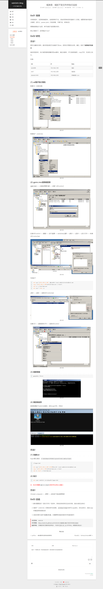

- [1. 域控向域主机下发文件并执行远控](#1-域控向域主机下发文件并执行远控)
  - [1.1. 网络链接](#11-网络链接)
  - [1.2. 快照图片](#12-快照图片)

# 1. 域控向域主机下发文件并执行远控
## 1.1. 网络链接
[域控向域主机下发可执行文件](https://redn3ck.github.io/2018/03/01/%E5%9F%9F%E6%B8%97%E9%80%8F-%E5%9F%9F%E6%8E%A7%E4%B8%8B%E5%8F%91%E6%96%87%E4%BB%B6%E5%B9%B6%E6%89%A7%E8%A1%8C%E8%BF%9C%E6%8E%A7/)
## 1.2. 快照图片

