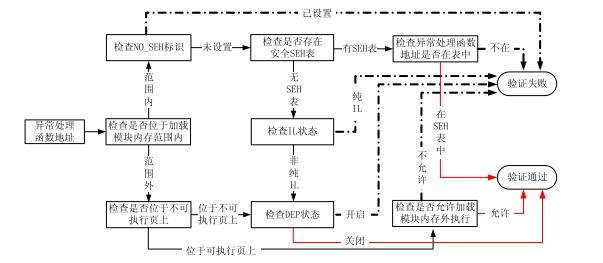

<!-- TOC -->

- [1. 内存保护机制概述](#1-内存保护机制概述)
    - [1.1. 漏洞起源](#11-漏洞起源)
    - [1.2. 内存保护机制](#12-内存保护机制)
    - [1.3. 内存保护机制的对抗](#13-内存保护机制的对抗)
- [2. GS编译技术](#2-gs编译技术)
    - [2.1. 原理](#21-原理)
    - [2.2. 一些机制](#22-一些机制)
    - [2.3. 弱点：GS保护条件](#23-弱点gs保护条件)
    - [2.4. 变量重排](#24-变量重排)
    - [2.5. 绕过](#25-绕过)
- [3. SafeSEH](#3-safeseh)
    - [3.1. 原理](#31-原理)
    - [3.2. 流程](#32-流程)
    - [3.3. 允许执行的情况](#33-允许执行的情况)
    - [3.4. 绕过](#34-绕过)
- [4. DEP：数据执行保护](#4-dep数据执行保护)
    - [4.1. 原理](#41-原理)
    - [4.2. 工作模式](#42-工作模式)
    - [4.3. 编译器选项：/NXCOMPAT](#43-编译器选项nxcompat)
    - [4.4. 局限性](#44-局限性)
    - [4.5. 绕过](#45-绕过)
        - [4.5.1. Ret2Libc（Return-to-libc）](#451-ret2libcreturn-to-libc)
        - [4.5.2. 其它方法](#452-其它方法)
- [5. ASLR](#5-aslr)
    - [5.1. 弱点](#51-弱点)
    - [5.2. 绕过](#52-绕过)
- [6. SEH覆写保护：SEHOP](#6-seh覆写保护sehop)
    - [6.1. 原理](#61-原理)
    - [6.2. 绕过方法](#62-绕过方法)
- [7. 堆的安全机制](#7-堆的安全机制)
    - [7.1. 安全机制](#71-安全机制)
        - [7.1.1. PEB random](#711-peb-random)
        - [7.1.2. Safe Unlink](#712-safe-unlink)
        - [7.1.3. heap cookie](#713-heap-cookie)
        - [7.1.4. 元数据加密](#714-元数据加密)
    - [7.2. 弱点及绕过](#72-弱点及绕过)
- [8. RELEO](#8-releo)

<!-- /TOC -->
# 1. 内存保护机制概述
## 1.1. 漏洞起源
冯诺依曼体系未对代码和数据作区分，现代漏洞大多基于这一点，导致用户数据被当作代码来执行。
## 1.2. 内存保护机制
* GS编译技术，在函数返回地址之前加入了Security Cookie，函数返回前首先检测Security Cookie是否被覆盖，对抗栈溢出
* SafeSEH，增加了对SEH的安全校验机制，对抗SEH覆盖
* DEP（数据执行保护），将数据部分标示为不可执行，阻止栈、堆和数据节中攻击代码的执行
* ASLR（加载地址随机），随机化可执行文件和动态链接库文件的加载地址，对抗溢出
* SEHOP（SEH覆写保护），将SEH的保护提升到系统级别，对抗SEH溢出
* 在堆中加入了Heap Cookie、Safe Unlinking等一系列的安全机制，对抗堆溢出
## 1.3. 内存保护机制的对抗
|目的|保护技术|
|:-:|:-:|
|覆盖返回地址|通过GS保护|
|覆盖SEH链|通过SafeSEH、SEHOP保护|
|覆盖本地变量|可能被VC编译器经过重新整理和优化|
|覆盖空闲堆双向链表|通过safe unlinking保护|
|覆盖堆块头|XP下使用8位的HeaderCookie进行保护，VISTA之后使用XOR HeaderData|
|覆盖lookaside linked list|Vista之后被移除|
# 2. GS编译技术
## 2.1. 原理
在函数开始时，位于EBP之前，向栈帧内压入一个DWORD（称作canary或者Security Cookie）。另外，系统会在.data的内存区域中存放一个Security Cookie的副本。在函数返回之前，系统会比较栈帧和.data中两个Security Cookie的值，如果两者不吻合，说明栈帧中的Security Cookie已被破坏，栈中发生了溢出，系统将进入异常处理流程，函数不会返回。
## 2.2. 一些机制
* 系统以.data节的第一个双字作为所有Security Cookie的种子（程序每次运行时种子不同）
* 在栈桢初始化以后，用ESP异或种子，来作为当前函数的Security Cookie，增加随机性。在函数返回前，用ESP还原出（异或）Security Cookie的种子
## 2.3. 弱点：GS保护条件
额外的数据和操作会导致系统性能下降，所以编译器在编译程序的时候，对以下函数并不会应用GS（`#pragma strict_gs_check`可以对函数强制添加GS保护）：
* 函数不包含缓冲区
* 函数被定义为具有变量参数列表
* 函数使用无保护的关键字标记
* 函数在第一个语句中包含内嵌汇编代码
* 缓冲区不是8字节类型且大小不大于4个字节
## 2.4. 变量重排
在VS2005及后续版本，GS选项同时会导致变量重排。编译器在编译时会根据局部变量的类型对变量在栈帧中的位置进行调整，将字符串变量移动到栈帧的高地址（防止字符串溢出时破坏其他的局部变量），将指针参数和字符串参数复制到低地址（防止函数参数被破坏）
## 2.5. 绕过
* 由于存在GS保护条件，利用未被保护的函数突破GS
* 同时替换栈中和.data中的Cookie突破GS
* GS是在函数返回时对栈进行检查，那么只要在函数返回之前进行控制流劫持即可，例如攻击C++的虚函数或者异常处理
# 3. SafeSEH
## 3.1. 原理
在程序调用异常处理函数前，对要调用的异常处理函数进行一系列的有效性校验，当发现异常处理函数不可靠时将终止异常处理函数的调用。另外，编译器在编译程序的时候将程序所有的异常处理函数地址提取出来，编入一张安全SEH表（安全SEH表的信息在内存中是加密存放的），并将这张表放到程序的映像里面。当程序调用异常处理函数的时 候会将函数地址与安全SEH表进行匹配，检查调用的异常处理函数是否位于安全SEH表中。
## 3.2. 流程
SafeSEH的功能是在RtlDispatchException函数中实现的：
* 检查异常处理链是否位于当前程序的栈中，如果不在当前栈中，程序将终止异常处理函数的调用
* 检查异常处理函数指针是否指向当前程序的栈中，如果指向当前栈中，程序将终止异常处理函数的调用
* 调用RtlIsValidHandler进行进一步校验

## 3.3. 允许执行的情况
* 异常处理函数位于加载模块内存范围之外，DEP关闭
* 异常处理函数位于加载模块内存范围之内，相应模块未启用SafeSEH（安全SEH表为空），同时相应模块不是纯IL
* 异常处理函数位于加载模块内存范围之内，相应模块启用SafeSEH（安全SEH表不为空），异常处理函数地址包含在安全SEH表中
## 3.4. 绕过
* 在加载模块内存范围之外（除了PE和DLL之外的一些Map映射）找到一个跳板指令，转入shellcode执行（不考虑DEP）
* 利用未启用SafeSEH模块中的指令作为跳板，转入shellcode执行（所以SafeSEH需要操作系统与编译器的双重支持，在加载模块中找到一个未启用的SafeSEH模块并不难）
* 清空安全SEH表，造成该模块未启用SafeSEH的假象
* 将注入的指令注册到安全SEH表中
* 将shellcode布置到堆区，直接跳转执行
* 直接利用未启用SafeSEH的模块（如Adobe Flash Player ActiveX控件）
* 攻击返回地址或者C++虚函数
# 4. DEP：数据执行保护
## 4.1. 原理
将数据所在内存页（如默认的堆页、各种堆栈页以及内存池页）标识为不可执行，阻止shellcode执行。根据实现的机制不同可分为软件DEP和硬件DEP：
* 与CPU硬件无关，Windows利用软件模拟实现DEP，对操作系统提供一定的保护
* 硬件DEP需要CPU的支持，操作系统通过设置内存页的NX（AMD）/XD（Intel）属性标记，来指明不能从该内存执行代码
## 4.2. 工作模式
根据启动参数的不同，DEP工作模式可以分为四种：
* Optin：
    * 仅将DEP保护应用于Windows系统组件和服务，对于其他程序不予保护
    * 用户可以通过应用程序兼容性工具为选定的程序强制启用DEP
    * Vista及后续操作系统中，经过/NXCOMPAT选项编译过的程序将启用DEP
    * 这种模式可以被应用程序动态关闭
* Optout：为排除列表程序外的所有程序和服务启用DEP，用户可以手动在排除列表中指定不启用DEP保护的程序和服务。这种模式可以被应用程序动态关闭
* AlwaysOn：对所有进程启用DEP的保护，DEP不可以被关闭，目前只有在64位的操作系统才工作在AlwaysOn模式
* AlwaysOff：对所有进程都禁用DEP，DEP不能被动态开启

通过计算机属性和`c:\boot.ini`文件中的`/noexecute`启动项的值，可以控制DEP的工作模式。
## 4.3. 编译器选项：/NXCOMPAT
采用/NXCOMPAT选项编译的程序会在文件的PE头中设置IMAGE_DLLCHARACTERISTICS_NX_COMPAT标识，该标识通过结构体IMAGE_OPTIONAL_HEADER中的DllCharacteristics变量进行体现，当DllCharacteristics设置为0x0100表示该程序采用了/NXCOMPAT编译。经过/NXCOMPAT选项编译的程序在Vista及后续操作系统中会自动启用DEP。
## 4.4. 局限性
* 硬件DEP需要CPU的支持
* Windows不能对所有进程开启DEP保护，否则可能会出现执行异常
* 当DEP工作在Optin和Optout下时，DEP是可以被动态关闭和开启的
## 4.5. 绕过
### 4.5.1. Ret2Libc（Return-to-libc）
让程序返回到一个已经存在的系统函数中（必然存在于可执行页上），利用系统函数中的指令来完成功能，并在之后通过系统函数中的返回指令加上栈帧的配合回收程序的控制权。通过这种方法完成完整功能较为繁琐，可以通过以下三种方法简化过程：
* 跳转到ZwSetInformationProcess函数将DEP关闭后再转入shellcode执行
* 跳转到VirtualProtect函数来将shellcode所在内存页设置为可执行状态，然后再转入shellcode执行
* 跳转到VIrtualAlloc函数开辟一段具有执行权限的内存空间，然后将shellcode复制到这段内存中执行
### 4.5.2. 其它方法
* 利用可能存在的可执行内存（如系统功能需要而创建的可执行内存）
* 攻击.NET、Java applet中的可执行内存部分
# 5. ASLR
对映像基址（可通过注册表修改工作模式为禁用、强制和根据PE头标识启用）、堆栈和PEB、TEB的加载地址进行地址随机化，从而干扰shellcode的定位。支持ASLR的程序会在它的PE头中设置IMAGE_DLL_CHARACTERISTICS_DYNAMIC_BASE标识。ASLR对应到编译器的/dynamicbase链接选项。
## 5.1. 弱点
* 映像基址的偏移即后两个字节是固定不变的
* 堆栈随机化的防护面有限
* PEB、TEB随机化的程度有限（在0x7FFDF000~0x7FFD4000之间移动），而且可以通过别的方法定位
## 5.2. 绕过
* 利用未采用ASLR的模块（如Adobe Flash Player ActiveX控件）
* 部分覆盖：映像基址随机化只对地址的前2个字节做随机化处理，而函数的返回地址、异常处理函数的指针、虚函数表指针存放在堆栈中，其相对于返回地址的偏移一般不会大于0x10000，所以我们只需要覆盖返回地址的最后一到两个字节即可定位
* Heap Spray（包括Java applet heap spray）
* .NET平台的IL-Only文件会强制启用ASLR，但是在.NET控件的运行版本号小于2.5的情况下会禁用ASLR
# 6. SEH覆写保护：SEHOP
## 6.1. 原理
在程序转入异常处理前，且在SafeSEH的RtlIsValidHandler函数校验前，SEHOP会检查SEH链上最后一个异常处理函数是否为系统默认异常处理函数，即检查SEH链的完整性。其伪代码如下：
```c
if (process_flags & 0x40 == 0) {     //如果没有SEH记录则不进行检测
    if (record != 0xFFFFFFFF) {
        //开始检测
        do {
            if (record < stack_bottom || record > stack_top)     //SEH记录必须位于栈中
                goto corruption;
            if ((char*)record + sizeof(EXCEPTION_REGISTRATION) > stack_top)    //SEH记录结构需完全在栈中
                goto corruption;
            if ((record & 3) != 0) //SEH 记录必须 4 字节对齐
                goto corruption; handler = record->handler;
            if (handler >= stack_bottom && handler < stack_top) //异常处理函数地址不能位于栈中
                goto corruption; record = record->next; 
        } while (record != 0xFFFFFFFF); 
        //遍历 S.E.H 链 
        if ((TEB->word_at_offset_0xFCA & 0x200) != 0) { 
            if (handler != &FinalExceptionHandler)//核心检测，地球人都知道，不解释了 
                goto corruption; 
        }
    } 
}
```
## 6.2. 绕过方法
* 攻击函数返回地址或者虚函数等
* 利用未启用SEHOP的模块（编译器没有相关选项，但是微软出于兼容性的考虑对一些程序禁用了SEHOP，例如经过Armadilo加壳的软件。操作系统会根据PE头中的MajorLinkerVersion和MinorLinkerVersion两个标识来判断是否为程序禁用SEHOP。我们可以将这两个选项分别设置为0x53和0x52来模拟经过Armadilo加壳的程序，从而达到禁用SEHOP的目的）
* 伪造一个完整的SEH链（定位FinalExceptionHandler函数的时候会受到ASLR的影响）
# 7. 堆的安全机制
## 7.1. 安全机制
### 7.1.1. PEB random
对PEB、TEB基址进行随机化。
### 7.1.2. Safe Unlink
在Unlink之前检查结点的指向是否正确。
```
//普通卸载
int remove (ListNode * node) {
    node -> blink -> flink = node -> flink;
    node -> flink -> blink = node -> blink; 
    return 0;
}
//安全卸载
int safe_remove (ListNode * node) {
    if( (node->blink->flink==node)&&(node->flink->blink==node) ) {
        node -> blink -> flink = node -> flink; 
        node -> flink -> blink = node -> blink; 
        return 1; 
    }
    else{
        //链表指针被破坏，进入异常 
        return 0;
    }
}
```
### 7.1.3. heap cookie
原理类似于栈中的security cookie，用于检测堆溢出的发生，大小为1个字节。
### 7.1.4. 元数据加密
在保存块首中的一些重要数据时，会与一个4字节的随机数进行异或运算，在使用这些数据时候需要再进行一次异或来还原。
## 7.2. 弱点及绕过
* PEB、TEB随机化的程度有限（在0x7FFDF000~0x7FFD4000之间移动），尤其在多线程状态下容易被预测出来
* heap cookie的变化区间为0-256，区间过小
* 堆的各项保护措施是对堆块的关键结构进行保护，而对于堆中存储的内容是不保护的。所以可以攻击堆中存放的一些重要的数据或结构指针，如函数指针等
# 8. RELEO
ELF文件独有的安全机制，用于防止got、plt和fini_array（程序结束时调用的函数组）被劫持，分为以下三种状态：
* Disabled：got表和plt表可写，fini_array可写
* Partial（默认）：只有got表可写
* Fulled：load time的时候全部函数的地址都已经resolve完成，不可写
