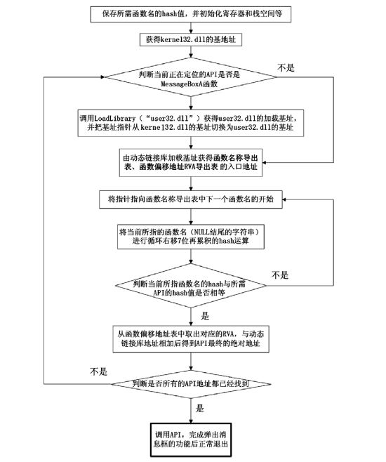
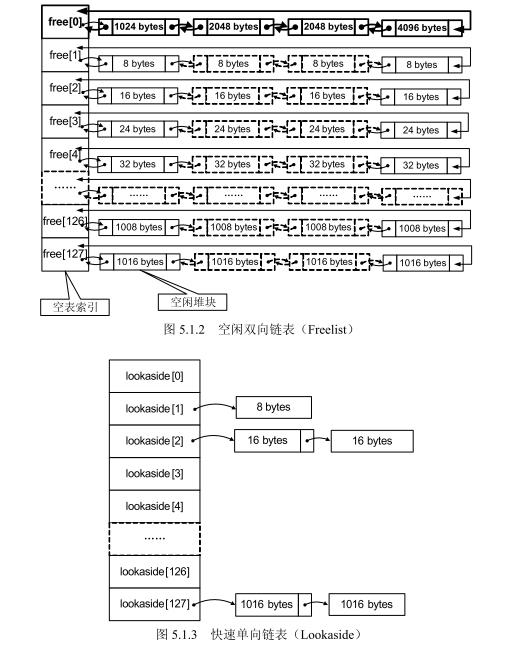

<!-- TOC -->

- [1. 概述](#1-概述)
  - [1.1. 来源](#11-来源)
  - [1.2. 基础知识](#12-基础知识)
- [2. shellcode](#2-shellcode)
  - [2.1. 缓冲区的组织](#21-缓冲区的组织)
  - [2.2. 开发通用shellcode：跨平台、跨计算机](#22-开发通用shellcode跨平台跨计算机)
  - [2.3. shellcode编码技术](#23-shellcode编码技术)
    - [2.3.1. 原因](#231-原因)
    - [2.3.2. 解决方案](#232-解决方案)
    - [2.3.3. 集成](#233-集成)
  - [2.4. shellcode压缩](#24-shellcode压缩)
- [3. Metasploit](#3-metasploit)
  - [3.1. 流程](#31-流程)
  - [3.2. 模块](#32-模块)
  - [3.3. MSF的插件程序](#33-msf的插件程序)
- [4. 堆溢出](#4-堆溢出)
  - [4.1. 堆与栈的区别](#41-堆与栈的区别)
  - [4.2. 堆的组织方式](#42-堆的组织方式)
    - [4.2.1. 堆块和堆表](#421-堆块和堆表)
    - [4.2.2. 空闲双向链表](#422-空闲双向链表)
    - [4.2.3. 快速单向链表](#423-快速单向链表)
    - [4.2.4. 堆组织方式图](#424-堆组织方式图)
  - [4.3. 堆操作](#43-堆操作)
    - [4.3.1. 普通堆块分配](#431-普通堆块分配)
    - [4.3.2. 堆块释放](#432-堆块释放)
    - [4.3.3. 堆块合并](#433-堆块合并)
    - [4.3.4. 堆块分配策略](#434-堆块分配策略)
  - [4.4. 堆的调试](#44-堆的调试)
  - [4.5. 堆块首部结构](#45-堆块首部结构)
  - [4.6. 堆操作溢出](#46-堆操作溢出)
    - [4.6.1. 一些注意事项](#461-一些注意事项)
  - [4.7. 利用chunk重设大小攻击堆](#47-利用chunk重设大小攻击堆)
  - [4.8. 利用Lookaside表进行堆溢出](#48-利用lookaside表进行堆溢出)
- [5. 其它内存攻击技术](#5-其它内存攻击技术)
  - [5.1. SEH](#51-seh)
  - [5.2. VEH](#52-veh)
  - [5.3. 攻击TEB中的SEH头节点](#53-攻击teb中的seh头节点)
    - [5.3.1. 局限性](#531-局限性)
  - [5.4. 攻击UEF](#54-攻击uef)
  - [5.5. 攻击PEB中的函数指针](#55-攻击peb中的函数指针)
  - [5.6. off by one](#56-off-by-one)
  - [5.7. C++的虚函数](#57-c的虚函数)
  - [5.8. bss溢出](#58-bss溢出)
  - [5.9. data溢出](#59-data溢出)
  - [5.10. 整数溢出](#510-整数溢出)
  - [5.11. UAF](#511-uaf)
  - [5.12. Double Free](#512-double-free)
  - [5.13. 堆喷：Heap Spray](#513-堆喷heap-spray)
    - [5.13.1. 示例代码](#5131-示例代码)
- [6. 手机里的缓冲区溢出](#6-手机里的缓冲区溢出)
- [7. 其它类型的软件漏洞](#7-其它类型的软件漏洞)
  - [7.1. printf函数的格式化串漏洞](#71-printf函数的格式化串漏洞)
  - [7.2. 逻辑漏洞](#72-逻辑漏洞)
  - [7.3. SQL注入](#73-sql注入)
  - [7.4. 其它注入](#74-其它注入)
    - [7.4.1. Cookie注入](#741-cookie注入)
    - [7.4.2. XPath注入](#742-xpath注入)
  - [7.5. XSS](#75-xss)
  - [7.6. 路径回溯漏洞](#76-路径回溯漏洞)

<!-- /TOC -->
# 1. 概述
## 1.1. 来源
本笔记内容来自《0day安全-软件漏洞分析技术》。
## 1.2. 基础知识
以下知识均为逆向基础知识，此处做个记录，不再赘述。
* 漏洞概述
    * BUG与漏洞
    * 漏洞挖掘 -> 漏洞分析（POC） -> 漏洞利用（EXP）
    * 漏洞公布：CVE、CERT
* 二进制文件格式
    * PE格式
    * 虚拟内存（4GB进程空间）
    * PE格式与虚拟内存的映射
* 工具
    * OD、SoftICE（Compuware SoftICE Driver Suite 驱动套件）、WinDbg
    * IDA Pro
    * UE、010 Editor、Winhex
    * VMWare
    * Python
* 栈溢出
    * 内存布局（代码、数据、栈、堆等）
    * 函数调用与栈帧、函数调用约定
    * 缓冲区溢出覆盖变量、EBP、返回地址（可以利用返回地址执行栈中植入的代码）
    * 使用JMP ESP（使用kernel32或者user32里面的代码，地址一般情况下稳定）作为跳转，以防栈区地址变化
# 2. shellcode
* shellcode为功能代码（payload）
* exploit为攻击代码
## 2.1. 缓冲区的组织
* 缓冲区组成（shellcode、nop、跳转地址）
* 跳板
    * jmp esp（mov eax,esp ; jmp eax等等）
    * 通过nop大片淹没缓冲区，盲跳
* 注意事项
    * 抬高栈顶保护shellcode，以防栈帧返回后的栈操作破坏了shellcode
* 函数返回地址移位（缓冲区前期填充内容长度不定，可能导致覆盖返回地址出现1-3个字节的偏移）
    * 解决方法：堆喷，使用4字节相同的返回地址如0C0C0C0C
## 2.2. 开发通用shellcode：跨平台、跨计算机
* 定位API：通过PEB
    * 缩短shellcode：为了节省存储函数名称的空间，插入hash算法，通过比对字符串的hash值来替换字符串比对
    * 在将HASH压入栈中之前，需要先将增量标识DF清零，因为当通过异常处理机制植入shellcode的时候，往往会产生标志位的变化，使得shellcode中的字符串处理方向被改变，从而出现错误
* shellcode的调试：初始化一个进程环境 + 指针跳转
* shellcode：可以直接从Metasploit中获取各种语言、各种功能、各种平台的shellcode

## 2.3. shellcode编码技术
### 2.3.1. 原因
* NULL字节截断限制
* 可打印字符限制
* IDS特征检测与拦截
### 2.3.2. 解决方案
解码器+编码，类似于加壳（现在很多杀毒软件会采取内存杀毒，即先将程序加载到内存中，再进行查杀），最简单的编码方式为异或
### 2.3.3. 集成
Metasploit提供了大量的编码解码方式
## 2.4. shellcode压缩
* 使用短指令、复合指令（一个指令多个功能）
* 函数调用参数
    * 参数地址重合
    * 多个压入NULL的指令可以合并为一个内存空间填0的指令
* 代码和数据复用（例如一个函数的参数为结构体或内存大小的值，只要大于某个数函数就会正常执行，这时就可以将一块代码当作数据作为参数，节省一个压栈指令）
* 调整栈顶回收栈顶之上的废弃数据，节省初始化栈区的指令
* 利用寄存器存储数据，避免栈区的复杂操作
* hash字符串（需要定制合适的hash算法）
# 3. Metasploit
Metasploit3.X版本基于Ruby语言：
* Ruby（MSF开发必需）
* 编写EXP
* 发布POC
## 3.1. 流程
* 触发漏洞
* 选取shellcode
* 设定目标等参数
* 选用编码解码算法
## 3.2. 模块
* exploit：漏洞触发信息
* auxiliary：MSF额外的插件程序，如网络欺骗工具、DOS工具、Sniffer工具等
* payload：可运行于多种操作系统下、多种功能的大量shellcode
* encoder：编码算法
* nop：填充数据（不影响shellcode执行的指令）生成器，提供了不同操作系统、不同语言的的填充数据生成，用于组织缓冲区
## 3.3. MSF的插件程序
* msfpescan可以直接扫描PE文件中的跳板指令
# 4. 堆溢出
本书将主要基于Windows2000-Windows XP SP1平台的堆管理策略。
## 4.1. 堆与栈的区别
|类别|堆|栈|
|:-:|:-:|:-:|
|结构|动态增长的链表|函数局部数组|
|申请方式|用malloc函数申请|程序中直接声明|
|释放方式|用free函数释放|系统自动回收|
|管理方式|程序员管理|系统管理|
|所处位置|变化范围很大||
|增长方向|低->高（不考虑内存碎片）|高->低|
## 4.2. 堆的组织方式
### 4.2.1. 堆块和堆表
* 堆块：堆区的内存按不同大小组织成块，称为堆块。一个堆块包括两个部分：块首（堆块头部的几个字节，标识这个堆块自身的信息如块的大小、空闲还是占用，另外还有用于链入堆表的指针）和块身（分配给用户使用的空间）。
* 堆表：堆表一般位于堆区的起始位置，用于索引堆块。堆表的数据结构决定了堆的组织方式。在Windows中，占用态的堆块被使用它的程序索引，而堆表只索引所有空闲态的堆块。最重要的堆表有两种：
    * 空闲双向链表：Freelist，简称空表
    * 快速单向链表：Lookaside，简称快表。只有堆是可扩展的时候（在HeapCreate函数参数中指定）快表才会启用。
### 4.2.2. 空闲双向链表
根据所链入堆块的大小来区分，空闲双向链表总共有128条（每条链表所链入堆块大小=索引×8字节，如第二条链表`free[1]`链入了所有大小为8字节的空闲堆块），堆表区中有一个128项的指针数组，作为空闲双向链表的表头。而第一条链表`free[0]`链入了所有大于等于1024字节小于512KB的堆块，这些堆块根据各自的大小按照升序排列。
### 4.2.3. 快速单向链表
快速单向链表是Windows用来加速堆块分配而采用的一种堆表，这类单向链表之所以快，是因为其中从来不会发生堆块合并（其中的空闲块块首被设置为占用态，用来防止堆块合并）。快表也有128条，其组织结构与空表类似，只是其中的堆块按照单链表组织。快表总是被初始化为空，而且每条快表最多只有4个结点，故很快就会被填满。
### 4.2.4. 堆组织方式图

## 4.3. 堆操作
### 4.3.1. 普通堆块分配
堆块分配步骤如下：
* 快表分配：在快表中寻找大小精确匹配的空闲堆块，失败则继续。
* 普通空表精确分配：在空表中寻找大小精确匹配的空闲堆块，失败则继续。
* 普通空表分割分配：在空表中寻找最小的能够满足要求的空闲块，失败则继续。成功则从中按请求的大小精确分割出一块进行分配，然后将剩下的部分重新标注块首，链入空表。
* 零号空表分配：先判断最后一个块即表中最大块能否满足要求（如果最大块都无法满足要求，前面的小块更无法满足），如果能则正向搜索最小的能够满足要求的空闲块进行精确或分割型分配。

任何时候寻找到或者分割出合适的堆块后，就将其状态修改为占用态，把它从堆表中摘除，最后返回一个指向堆块块身的指针给程序使用。
>注意：这里没有讨论堆缓存（heap cache）、低碎片堆（LFH）和虚分配。
### 4.3.2. 堆块释放
将堆块状态改为空闲，链入相应的堆表的末尾（分配的时候也先从堆表末尾拿）。
### 4.3.3. 堆块合并
经过反复的申请与释放操作，堆区会产生很多内存碎片，不利于内存有效利用。当堆管理系统发现两个空闲堆块彼此相邻的时候，就会进行堆块合并操作：
* 将两个块从空闲链表中摘除
* 合并堆块
* 调整合并后大块的块首信息
* 将新块重新链入空闲链表。

另外，堆区还可以进行内存紧缩操作，由RtlCompactHeap执行，该操作会对整个堆进行调整，尽量合并可用的碎片。
### 4.3.4. 堆块分配策略
|类别|大小|分配|释放|
|:-:|:-:|:-:|:-:|
|小块|<1KB|快表分配->普通空表分配->堆缓存分配->零号空表分配->进行内存紧缩后再尝试分配->若仍无法分配，返回NULL|链入快表（只能链入4个空闲块）->如果快表满，则将其链入相应的空表|
|大块|1KB≤SIZE<512KB|堆缓存分配->零号空表分配|放入堆缓存->若堆缓存满，将链入零号空表|
|巨块|≥512KB|非常罕见，使用虚分配方法（实际上并不是从堆区分配的）|直接释放，无堆表操作|
## 4.4. 堆的调试
堆的调试与栈的调试不同，调试器加载程序和正常启动程序两者的堆是有差异的，所以如果需要调试正常启动程序的堆，需要在程序中插入`int 3`指令，程序正常启动，中断后再附加调试。详细差异细节及调试过程细节见书内。
## 4.5. 堆块首部结构
由于已经过时，见书内。
## 4.6. 堆操作溢出
在堆块的分配、释放、合并中，会出现一系列的链表操作。如果通过堆溢出淹没堆块的块首信息，改写堆块的链表前后指针，就可以在链表操作中得到一次写入任意内存地址为任意值的机会（原理可查阅百度资料或者自行模拟）。通过写入以下地址，就可以劫持控制流：
* 栈帧中的返回地址
* SEH
* 重要系统函数的调用地址（got表、IAT表）
* PEB中线程同步函数的入口地址：每个进程的PEB中都存放着一对同步函数指针，指向RtlEnterCriticalSection和RtlLeaveCriticalSection，在进程退出时这两个函数会被 ExitProcess函数调用（PEB的位置和这对指针在PEB中的偏移始终不会变化，所以这个写入点比较稳定），测试平台为win2000
* 其它软性目标
    * 内存变量
    * 执行代码
### 4.6.1. 一些注意事项
* 调试堆与正常堆存在区别
* shellcode中可能需要修复原环境
* 如何定位shellcode：跳板技术
* DWORD SHOOT会导致两块内存被改写，其中一块用作劫持控制流，另外一块则会导致shellcode中的4个字节被改写，需要注意以防破坏shellcode的功能
## 4.7. 利用chunk重设大小攻击堆
在进行堆分配的时候，如果申请的空间小于堆块的大小，会将堆块分割，将剩余的堆块链入堆表，在这个链入过程中，通过操控前后指针，就可以获得DWORD SHOOT的机会。
## 4.8. 利用Lookaside表进行堆溢出
快表中的单链表在拆卸时没有进行安全校验，通过修改自身的后指针，可以修改拆卸后前一个堆块的后指针为任意值。在下一次进行堆块分配时，会将任意值指向的堆块分配出去，如果拥有本次分配出来的内存的写入权，就获得了一次写入任意内存的机会。
# 5. 其它内存攻击技术
## 5.1. SEH
SEH结构体位于栈中，通过栈溢出或者堆溢出修改SEH结构体，即可实现劫持控制流。
## 5.2. VEH
利用堆溢出的DWORD SHOOT修改指向VEH头节点的指针，在异常处理开始后，即可实现劫持控制流。
## 5.3. 攻击TEB中的SEH头节点
线程的SEH链通过TEB的第一个DWORD标识(fs:0)。通过修改TEB中的这个指针，在异常发生时就能劫持控制流。
### 5.3.1. 局限性
在多线程环境下，每个线程都有一个TEB，第一个TEB开始于地址0x7FFDE000，之后新建线程的TEB将紧随前边的TEB，之间相隔0x1000字节，并向内存低址方向增长。当线程退出时，对应的TEB也被销毁，腾出的TEB空间可以被新建的线程重复使用。所以当遇到多线程的程序（尤其是服务器程序，存在大量的新建、销毁线程操作）时，将难以定位TEB。因此，攻击TEB中SEH头节点的方法一般用于单线程的程序。虽然通过创建很多线程或关闭大量线程或许可以控制TEB排列，但是在多线程状态下，还有许多比利用TEB更加容易的备选方案。
## 5.4. 攻击UEF
UnhandledExceptionFilter即系统默认的异常处理函数，如果能够利用堆溢出产生的DWORD SHOOT将该函数的调用句柄覆盖为shellcode的入口地址，再制造一个其他异常处理都无法解决的异常，那么当系统调用UEF时，shellcode就可以得到执行。UEF句柄在不同操作系统和补丁版本下可能不同，通过反汇编kernel32.dll中的导出函数SetUnhandledExceptionFilter即可获取。有的时候，结合UEF和跳板技术，能够让成功率更高。在异常发生时，EDI往往仍然指向堆中离shellcode不远的地方，把UEF的句柄覆盖成一条`call dword ptr [edi+0x78]`的指令地址往往就能让程序跳到shellcode中，除此以外，ESI、EBP、EBX、EDX等寄存器也有同样的效果。
## 5.5. 攻击PEB中的函数指针
ExitProcess在清理现场的时候需要进入临界区以同步线程，因此会调用RtlEnterCriticalSection和RtlLeaveCriticalSection，这两个函数的指针存放在PEB中，所以通过DWORD SHOOT把PEB中的这对指针修改成shellcode的入口地址，那么，在程序最终结束时，shellcode将获取控制权。PEB的位置永远不变，因此，这种方法更加可靠。
## 5.6. off by one
仅仅溢出了一个或者少数几个字节的情况，可以对EBP造成一定范围的偏移导致溢出，另外还可以结合破坏邻接变量，控制程序执行流程或者导致整数溢出等问题。
## 5.7. C++的虚函数
在C++中，多态特性主要靠对虚函数的动态调用来体现。一个类中可能有很多个虚函数，虚函数的入口地址被统一保存在虚表（Vtable）中，对象在使用虚函数时，先通过虚表指针找到虚表，然后从虚表中取出最终的函数入口地址进行调用。虚表指针保存在对象的内存空间中，紧接着虚表指针的是其他成员变量。如果对象中的成员变量发生了溢出，有机会修改对象中的虚表指针或修改虚表中的虚函数指针，那么在程序调用虚函数时就会跑去执行shellcode。
## 5.8. bss溢出
## 5.9. data溢出
通常用于覆盖指针。
## 5.10. 整数溢出
通常位于无符号与有符号转换和整数加减乘除法，通常转换为缓冲区溢出和逻辑漏洞等。
## 5.11. UAF
## 5.12. Double Free
## 5.13. 堆喷：Heap Spray
堆喷并非一种攻击型技术，是一种shellcode定位技术（因为堆分配的地址有较大的随机性），配合别的内存攻击技术如堆溢出、栈溢出进行使用。堆喷技术早期常用于攻击浏览器。将EIP指向堆区的0x0C0C0C0C位置，然后申请大量堆内存，并用包含着slidecode（滑板指令，不影响shellcode的执行，如0x90即`nop`、0x0C即`OR AL 0x0C`、0x0D，一般选取0x0C可以避免出现覆盖虚函数指针导致的问题）和shellcode的内存块覆盖这些内存。通常，内存分配会从内存低址向高址分配内存，因此当申请的内存超过200MB（200MB=200×1024×1024 = 0x0C800000 > 0x0C0C0C0C）后，0x0C0C0C0C将被含有shellcode的内存块覆盖。只要内存片中的slidecode能够命中0x0C0C0C0C的位置，shellcode就能最终得到执行。
### 5.13.1. 示例代码
```JavaScript
 //生成一个1MB大小充满0x90的数据块，为单个内存块
var nop = unescape("%u9090%u9090"); 
while(nop.length<= 0x100000/2) {
    nop += nop; 
}   
//在Heap Spray时，内存块相对于shellcode和额外的内存信息来说应该“足够大”，这样nop区域命中0x0C0C0C0C的几率将相对增加
//如果内存片较小，shellcode或额外的内存信息将有可能覆盖0x0C0C0C0C，导致溢出失败
//1MB的内存相对于200字节左右的shellcode，可以让exploit拥有足够的稳定性
//减去shellcode和额外信息所占据的空间，堆块信息（32） 字符串长度（4） 字符串结束符，两个字节的NULL（2）
nop = nop.substring(0, 0x100000/2 - 32/2 - 4/2 - shellcode.length - 2/2 );
var slide = new Arrary();         //申请数组
for (var i = 0; i < 200; i++) {
    slide[i] = nop + shellcode    //写入200MB数据
}
```
# 6. 手机里的缓冲区溢出
暂缓。
# 7. 其它类型的软件漏洞
## 7.1. printf函数的格式化串漏洞
格式化串漏洞产生于数据输出函数中对输出格式解析的缺陷。当变量数量小于格式化字符串中控制符的数量的时候，就会导致读取到栈中更高地址的数据。如果可以控制格式化字符串的内容，就可以实现读取内存数据。结合`%n`控制符，就可以实现写内存数据。wprintf等printf系列函数均可能存在类似漏洞。
## 7.2. 逻辑漏洞
* 访问控制
* 协议漏洞
* fakefuzz（多线程竞态条件）
## 7.3. SQL注入
暂缓。
## 7.4. 其它注入
### 7.4.1. Cookie注入
暂缓。
### 7.4.2. XPath注入
暂缓。
## 7.5. XSS
暂缓。
## 7.6. 路径回溯漏洞
暂缓。
